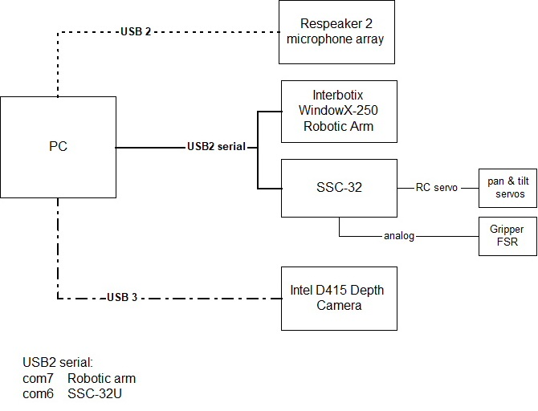

# Electronics

The robot's primary hardware is composed of:

1. [Interbotix WidowX-250 robotic arm](https://www.trossenrobotics.com/widowx-250-robot-arm.aspx)
2. [Intel D415 Depth Camera](https://www.intelrealsense.com/depth-camera-d415/)
3. [SSC-32U servo controller](http://www.lynxmotion.com/p-1032-ssc-32u-usb-servo-controller.aspx)
4. [(2) HITEC HS-322HD servos](https://www.amazon.com/Hitec-33322S-HS-322HD-Standard-Karbonite/dp/B0006O3XEA)
5. [Interlink Electronics model 402 FSR](https://buyinterlinkelectronics.com/collections/new-standard-force-sensors/products/fsr-model-402)
6. [ReSpeaker microphone array v 2.0](https://www.amazon.com/gp/product/B07D29L3Q1/ref=ppx_yo_dt_b_asin_title_o04_s00?ie=UTF8&psc=1)
7. A Intel sixth generation i7 PC running Windows 10

A block diagram of the system is provided below:

The only electronic items that may require some detail other then the product link, are the  interface used with the robotic arm and the force sensing resister (FSR).  The serial communication (over USB) interface is used with the arm.  This requires that the OpenCM9.04-C controller be installed rather then the U2D2 controller. (see section 4.2.8.4 in documentation http://www.support.interbotix.com/)

The FSR is attached to the right inside gripper pad to provide the ability to determine the amount of force being applied to an object.  It provides a analog output, volts, which can be measured by the SSC-32U using a simple voltage divider with a 10K ohm resister.  Since the power for the robotic arm and the SSC-32 come from different sources, the ground of the voltage divider must be tied to the ground of the robotic arm's OpenCM9.04-C controller.