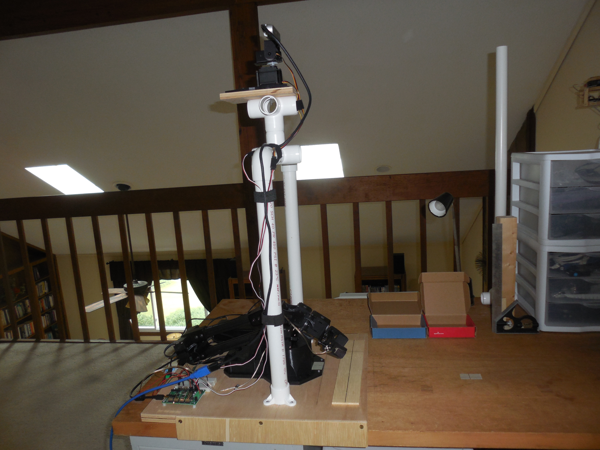
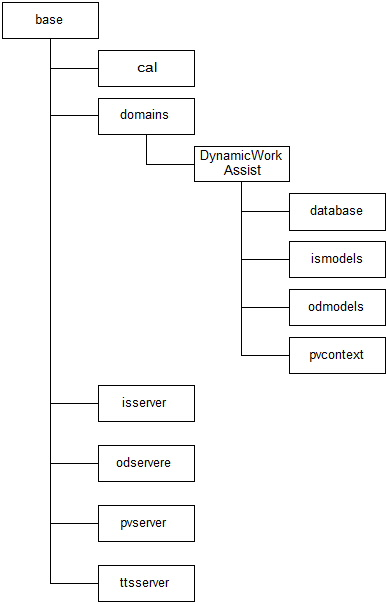

#  Autonomous Robotic Arm

This project is an experimental prototype to see if a robotic device using primarily "conventional" software can provide "smart" or even "intelligent" behavior in the real world with the aid of:

1. Currently "mature" deep learning technologies (object detection and image segmentation using transfer learning, speech recognition with transactional natural language processing (i.e. a chat bot)  and speech synthesis).
2. 3D perception hardware (depth camera, far field microphone array).
3. Domains of operation with significantly constrained context.

This was very much an engineering exercise.  The interest was not in how to achieve general AI or in mimicking a human. The interest is in determining if the current "tool set" is adequate to make autonomous robots.  Where autonomous in this case means the ability to complete tasks unaided in a dynamic environment that requires some "mental flexibility" but with a limited context domain. Please note that this project is not ongoing. It has an [MIT license](LICENSE.TXT) and is provided here for those interested in AI engineering that would like to use it as a starting point for their own work.

The project has one very significant prejudice, it assumes that primary operational capabilities must be provided locally.  This means that the AI inferences (including NLP for command and control) are done on the robot. This is primarily driven by latency considerations and the belief that allowing a multi-thousand dollar robot to cease working because the WiFi is down is not a good engineering decision.

The system is built around a Interbotix WidowX-250 robotic arm. The software development used multiple projects within a single Visual Studio 2019 solution.  The software is composed primarily of C# code with some Python and C++ organized in four assemblies:

1. The software that interfaces with the physical hardware and the AI servers is in Robot Arm.  It includes two projects, the Core C# project which implements most of the interfaces and the D415 project which provides a C++ based DLL required to get stable operation of the D415 in the C# environment.
2. The AI servers provide the ability to run object detection, image segmentation, speech recognition/NLP and speech synthesis models.  They were implemented as servers for two reasons.  Three of the servers are implemented in python.  All of them have the potential for being implemented on separate compute platforms (e.g. a Raspberry Pi) which might be the best architecture for an actual product.  The current implementation is as UDP "servers" on the localhost.
3. The domain specific software provides the operational control of the robotic arm when it is working in a specific domain.  Currently this consists solely of the "dynamic work assist" domain.
4. A test visual user interface.  In an actual product this would probably be a console application run on a "headless" compute platform with only a remote administration interface for diagnostics, domain management, robot start up and shut down etc.

The software assumes the following file organization scheme when deployed:

You can download a complete software image, which includes all the trained models, databases etc., from [here](https://1drv.ms/u/s!Akd6rkUaBWr4gTQub8I82e7nirgK?e=sacdyS)

## Conclusions
The key conclusions of the experiment are summarized below:

1. The critics of current "deep learning" AI [^1] are right. It is just narrowly focused base perception with little or no context.  As a result it is brittle and easily confused [^2]. But the show stopper is the lack of understanding about the associations used in the models.  Without that we can not adequately test the application since we really do not know how it is working.  This implies that we need to include every possibility, no matter how unlikely, in the training set.  In any domain of any complexity this is probably not possible.
2. There are significant possible scalability issues:
    - The development work load even for this toy domain could easily exceed the capabilities of all but substantial organizations if there were thousands of parts and hundreds of containers.  Even with the addition of a good MLOps platform and engineers trained for this type development, small to medium engineering departments would have a hard time doing anything useful in a reasonable period of time.
    - The compute resource requirements under the same circumstance would possibly exceed economical limits. Even off-loading domain storage, including code, AI models etc., to a company server when not in use may not save the day. A new generation of tools maybe starting to address this for "edge" applications. One example is provided in my  [Jetson AGX Orin developer kit project](https://github.com/terry-ess/JetsonOrin).
 3. The 3D accuracy limit was only marginally a problem in this implementation (there was a position accuracy error of roughly 3 to 5 mm).  But the implications for smaller objects and high precision, sub-millimeter, positioning are likely significant. The D415 camera does not provide the resolution or depth accuracy required for actions with very small objects or operations requiring high precision positioning.  Neither does the arm, but it is a reasonably priced research tool with a human reach.  There are commercial robotic arms available that would meet the accuracy and reach requirements but at much higher cost [^3].
## Final Thoughts
The AI technologies used do not represent the cutting edge.  They are the ones that are mature enough to be considered possibly "engineering ready" as opposed to basic research material and are small enough to fit likely compute resource limits.  There is an almost frantic pace of research going on.  One of these, deep reference learning, offers the possibility of providing the "low level" intelligence that could replace all or most of the heavy lifting required in the domain code.  Others are starting to provide some of the context needed for both visual and verbal models to be more reliable. While on the hardware side, new analog AI and neuromorphic chips may provide more accuracy, less power use, simpler training and much better scalability. But they are not ready for product development yet and in many cases are way too large for use on the robot. When they are ready we might have something really useful.

It may be that the AI goal is not correctly stated.  We do not want to create "human like" intelligence with all its flaws [^4], we want to create reliable and capable intelligence that will provide a tool for all of use to have better lives. This will take a lot more then just deep learning [^5].

[^1]: See Mitchell, Melanie. 2019. Artificial Intelligence, A Guide for Thinking Humans
[^2]: A case in point: after months of use, hand detection started to fail.  Why, it was warmer weather and I was wearing short sleeve shirts.  It detected the hand OK but the detection box went not to my wrist but up my arm to my sleeve. As a result it threw off the analysis of key points used to make motion decisions.  Correction required the creation of additional training images etc. and retrain.
[^3]: https://www.trossenrobotics.com/dobot-cr-collaborative-robot-series-cr3
[^4]: See Kahneman, Daniel. 2011. Thinking Fast and Slow
[^5]: See Marcus, Gary and Davis, Ernest. 2019. Rebooting AI: Building Artificial Intelligence We Can Trust