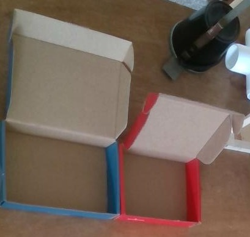
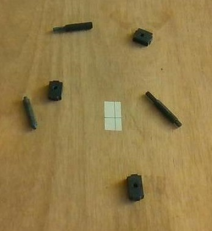

# Dynamic Work Assist

A domain is the basic building block for doing useful work.  It comprises a task or multiple related tasks that the robot can execute. It can be thought of as a game with specified board area, rules of operation, component parts etc. For scalability each domain is segregated and dynamically loadable. In this manner you can build a library of domains including domains that use multiple other domains.

The dynamic work assist domain is a simple example used to work through many of the issues necessary to developing a real domain, e.g. AI model selection, 3D spatial analysis etc.  In this implementation a domain consists of:

1. The primary operational code, in DLL form.
2. Databases for providing object definitions
3. The command and control grammar model
4. The object detection models
5. The image segmentation models.
6. The part specific analysis code, in DLL form. (Note: this was separated from 1 for potential scalability issues)

The dynamic work assist domain is basically a combination of simple pick and place capabilities with smart third hand tool capabilities in a dynamic environment with human interaction.

## Workspace
The workspace is a 41 cm by 41 cm area 7 inches directly in front of the robotic arm.  The internal workspace map consists of a two dimensional short integer array representing a 1 cm square block in the workspace.  Each square records the maximum height in mm detected at that location. The workspace frame of reference is illustrated below:

It should be noted that this domain specific definition of workspace is also used for the camera calibration in the test user interface's autonomous tab.  The workspace mapping code was therefore placed in the [core project](../../Core/README.md) since the test visual user interface was not intended to contain any operational code.
## Containers
Containers are objects in which parts can be placed.  In this implementation there are only two types of containers, red box or blue box. The blue box is a Respeaker Mic Array v 2.0 box.  The red box is a small (4 in. X 5 in.) SparkFun box. The script to create a SQLite database using the [DB Browser for SQLite](https://sqlitebrowser.org/) can be found in [containers.sql](containers.sql)

## Parts
Parts are objects that can be manipulated by the robotic arm.  In this implementation there are only two type of parts, shafts and end block.  Both are small plastic 3D printed parts. The script to create a SQLite database using the [DB Browser for SQLite](https://sqlitebrowser.org/) can be found in [parts.sql](parts.sql)

## User interface

The primary user interface is verbal.  The supported command and control grammar, context in Picovoice, is provided in [DynamicWorkAssist.yml](DynamicWorkAssist.yml).

## Rules of operation
1. The participants consist of one robotic arm and one human (i.e. the user).
2. The user gives the robotic arm a task which it then preforms with no user intervention.  The supported task are:
    - place one or all specific type part(s) in a container
    - take a part from or give a part to the user
    - position the gripper at an indicated location
    - manual controlled arm, wrist and gripper motion
3. Supports one each of the containers in the containers data base as placement locations
4. Supports parts in the parts database as manipulative objects
5. Parts must be in the workspace to be picked.
6. Parts must be separated.
5. Containers are located at the left or right edge of the work space [the containers are outside (because of work space calibration requirement) but next to the workspace (due to reach constraints)]. Containers should be aligned with the workspace edge with the top on the side of the container opposite the workspace and open.  Any container that does not meet these requirements is not usable.
6. Does not require any containers.
7. Containers and parts may not have a static location (i.e. they may be moved my a user).
8. Hands are not allowed in the workspace during movement except for "take this", "give me that", "position" or manual operation. Arm movement is not allowed if there is a hand in the work space (note: The serial interface to the robotic arm does not provide the ability to stop a motion once started, so this requirement is only enforced prior to each move)

## Design Decisions
What is real time? For human sight it is about 24 frames/sec or 42 ms.  For human verbal communication it is a response within 1 sec.  For detection of  a hand within the dynamic work assist work space it is about 200 ms, significantly slower then human sight.  The need is not to mimic humans, it is to perform the necessary task within the required time using the minimum computational resources.  As a result:

1. It primarily uses "lazy" obstacle detection (only looks when there is a need, e.g. just before a move, not continually scanning to detect changes in the work palace)
2. A slow workspace scan (~ 5 fps) is used to detect hands in the workspace during pick and place. The state of the hand scanning is used to determine if a hand check or part verification is necessary prior to the next move.
3. All the components for primary operation are implemented on the robot.  This includes all AI inferences.  If the robot were to also serve as a portal to information resources outside the primary operation that could (and probably would) use a interface to a "cloud" based conversational API etc.

The criteria for "success" was to create an implementation that performed its function correctly with the least resource usage and highest long term scalability potential.  It was not to mimic humans or advance the science of AI etc. This drove the heavy use of DLLs as the primary software components. It also drove the decision to not use any current deep learning accelerators, GPUs etc., just rely on CPUs. This is a decision that should be revisited as the cast of accelerators increases and their performance and power usage improve. But adding better hardware to the system will not change the [basic problem with deep learning](../../README.md). Finally, it lead to the evolution of a multi-level approach to using object detection, image segmentation and 3D information as illustrated below:

Take this command:

1. Detect hand with ssd_mobilenet_v1_fpn
2. Crop the image using the hand detection box and detect the object in the hand using ssd_mobilenet_v1.
3. Use the object detection box as input to image segmentation for pixel level detail.
4. Use the pixel level detail fused with 3D data to determine the  pick location and gripper orientation.

Surface part detection:

1. Crop the image to 640 X 640 centered on the workspace.
2. Detect parts using ssd_resnet50_v1_fpn.
3. Use the object detection boxes as input to image segmentation for pixel level detail.
4. Use the pixel level detail fused with 3D data to determine the pick location and gripper orientation.
## Software
The primary domain software is a C# based DLL composed of:

1. The main code (DynamicWorkAssist.cs)
2. Container related code (Containers.cs, ContainersDA0.cs)
3. Parts related code (Parts.cs, PartsDAS.cs)
4. Operation support code (HandDetect.cs, HdHandDetect.cs, ObstacleAvoid.cs, PnP.cs)

In addition two C# based DLL projects, end block and shaft, provide the part specific analysis code.